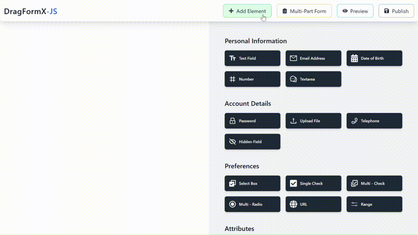
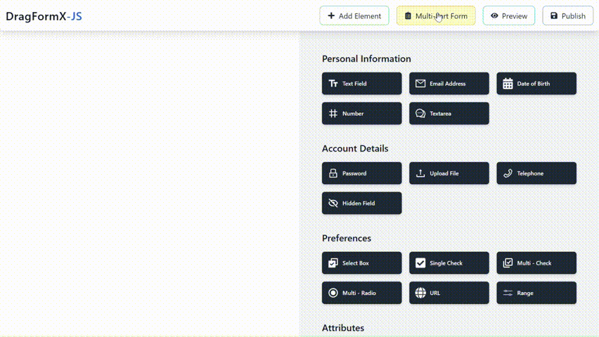

# 🚀 Formable


[](LICENSE)
[](https://www.npmjs.com/package/Formable)

> **Formable** is a powerful drag-and-drop form builder that empowers you to create interactive, validated forms effortlessly. Whether you're designing a sleek contact form or a robust multi-step application, Formable offers the flexibility and features you need to bring your forms to life! 🎨✨

---

## 📖 Table of Contents

- [🚀 Use Cases](#-use-cases)
- [📝 Overview](#-overview)
- [🌟 Features](#-features)
- [🎥 Visual Walkthrough](#-visual-walkthrough)
- [⚙️ Installation](./Manual.md)
  - [React Component Integration](Manual.md#react-component-integration)
  - [jQuery Integration](Manual.md#using-formable-in-jquery)
  - [Plain HTML with React CDN](Manual.md#Using-Formable-with-React.createElement)
- [🎛️ Configuration & Customization](#️-configuration--customization)
- [🤝 Contributing](#-contributing)
- [💬 Support](#-support)
- [📄 License](#-license)

---

## 🚀 Use Cases

Formable is perfect for a wide range of applications:

- **Rapid Prototyping** 🚀  
  Quickly design and test form layouts with an intuitive drag-and-drop interface.

- **Enterprise Applications** 🏢  
  Build robust forms with dynamic validations (required fields, regex patterns, min/max values) to meet complex business requirements.

- **E-commerce Platforms** 🛒  
  Create dynamic checkout, registration, or feedback forms that ensure accurate data entry.

- **Surveys & Feedback Forms** 📝  
  Design interactive forms to gather valuable insights from your users.

- **Content Management Systems** 📋  
  Enable non-technical users to build and customize forms within their CMS effortlessly.

- **Admin Dashboards** ⚙️  
  Generate forms on the fly for managing data or user inputs with ease.

---

## 📝 Overview

Formable provides an intuitive drag-and-drop interface that allows you to:

- **Drag Items:** Choose from over 18 form fields available in the sidebar.  
- **Drop & Customize:** Drag fields into the editor zone, and easily customize labels, placeholders, and validations dynamically.  
- **Live Preview:** Instantly switch to preview mode and see your form come to life in real-time.  
- **Flexible Integration:** Use as a React component, a jQuery plugin, or even integrate in plain HTML using React’s CDN.  
- **Dynamic Styling:** Customize the form's appearance using predictable class names.

---

## 🌟 Features

- **Drag-and-Drop Interface** 🎯  
  Build your forms effortlessly by dragging and dropping components.

- **18+ Form Fields** 📋  
  Includes text inputs, emails, passwords, dates, numbers, and many more.

- **Dynamic Validation** ✅  
  Configure validations like required fields, regex patterns, minimum/maximum values, and more.

- **Live Preview Mode** 👀  
  Instantly view your form in action with real-time updates.

- **Multiple Integration Modes** 🔌  
  Works seamlessly with React, jQuery, or as a standalone solution using React’s CDN.

- **Custom Styling** 🎨  
  Leverage detailed class names for complete control over your form's look and feel.

- **Extensible & Future-Proof** 🔮  
  More fields and functionalities are coming soon!

---

## 🎥 Visual Walkthrough

Imagine your screen divided into three primary sections:

1. **Sidebar** 🗂️  
   A collection of form components (text, email, number, etc.) to choose from.

2. **Editor Zone** 🖊️  
   Drag and drop your selected components into this central area to build your form.

3. **Preview Pane** 👁️  
   See your form rendered live with applied validations and custom styles.


> Example:  
>
>


---

## ⚙️ Installation

Formable can be integrated into your project in multiple ways:

### React Component Integration

Install via npm:

```bash
npm install formable --save
